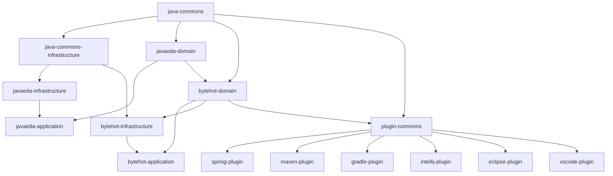

# ByteHot Repository Restructuring Plan

## Overview
Split the ByteHot monorepo into multiple focused repositories with proper Maven Central publishing.

## Repository Mapping

### Foundation Libraries
| Current Module | New Repository | Group ID | Artifact ID |
|----------------|----------------|----------|-------------|
| `java-commons` | `github:rydnr/java-commons` | `org.acmsl.commons` | `java-commons` |
| `java-commons-infrastructure` | `github:rydnr/java-commons-infrastructure` | `org.acmsl.commons` | `java-commons-infrastructure` |

### JavaEDA Framework
| Current Module | New Repository | Group ID | Artifact ID |
|----------------|----------------|----------|-------------|
| `javaeda-domain` | `github:java-eda/domain` | `org.acmsl.javaeda` | `javaeda-domain` |
| `javaeda-infrastructure` | `github:java-eda/infrastructure` | `org.acmsl.javaeda` | `javaeda-infrastructure` |
| `javaeda-application` | `github:java-eda/application` | `org.acmsl.javaeda` | `javaeda-application` |

### ByteHot Core
| Current Module | New Repository | Group ID | Artifact ID |
|----------------|----------------|----------|-------------|
| `bytehot-domain` | `github:bytehot/domain` | `org.acmsl.bytehot` | `bytehot-domain` |
| `bytehot-infrastructure` | `github:bytehot/infrastructure` | `org.acmsl.bytehot` | `bytehot-infrastructure` |
| `bytehot-application` | `github:bytehot/application` | `org.acmsl.bytehot` | `bytehot-application` |

### ByteHot Plugins
| Current Module | New Repository | Group ID | Artifact ID |
|----------------|----------------|----------|-------------|
| `bytehot-plugin-commons` | `github:bytehot/plugin-commons` | `org.acmsl.bytehot.plugins` | `plugin-commons` |
| `bytehot-spring-plugin` | `github:bytehot/spring-plugin` | `org.acmsl.bytehot.plugins` | `spring-plugin` |
| `bytehot-maven-plugin` | `github:bytehot/maven-plugin` | `org.acmsl.bytehot.plugins` | `maven-plugin` |
| `bytehot-gradle-plugin` | `github:bytehot/gradle-plugin` | `org.acmsl.bytehot.plugins` | `gradle-plugin` |
| `bytehot-intellij-plugin` | `github:bytehot/intellij-plugin` | `org.acmsl.bytehot.plugins` | `intellij-plugin` |
| `bytehot-eclipse-plugin` | `github:bytehot/eclipse-plugin` | `org.acmsl.bytehot.plugins` | `eclipse-plugin` |
| `bytehot-vscode-extension` | `github:bytehot/vscode-plugin` | `org.acmsl.bytehot.plugins` | `vscode-plugin` |

## Dependency Graph



## Migration Strategy

### Phase 1: Foundation Setup
1. Set up Maven Central publishing configuration
2. Create GitHub organizations and repositories
3. Configure CI/CD pipelines for each repository

### Phase 2: Extract Foundation Libraries
1. Extract `java-commons` (no dependencies)
2. Extract `java-commons-infrastructure` (depends on java-commons)
3. Publish to Maven Central

### Phase 3: Extract JavaEDA Framework
1. Extract `javaeda-domain` (depends on java-commons)
2. Extract `javaeda-infrastructure` (depends on java-commons-infrastructure, javaeda-domain)
3. Extract `javaeda-application` (depends on javaeda-domain, javaeda-infrastructure)
4. Publish to Maven Central

### Phase 4: Extract ByteHot Core
1. Extract `bytehot-domain` (depends on java-commons, javaeda-domain)
2. Extract `bytehot-infrastructure` (depends on java-commons-infrastructure, bytehot-domain)
3. Extract `bytehot-application` (depends on bytehot-domain, bytehot-infrastructure)
4. Publish to Maven Central

### Phase 5: Extract ByteHot Plugins
1. Extract `plugin-commons` (depends on java-commons, bytehot-domain)
2. Extract individual plugins (depend on plugin-commons)
3. Publish to Maven Central

### Phase 6: Update Main Repository
1. Update main ByteHot repository to use published artifacts
2. Remove extracted modules
3. Update documentation and examples

## Maven Central Publishing Configuration

### Sonatype OSSRH Setup
```xml
<distributionManagement>
  <snapshotRepository>
    <id>ossrh</id>
    <url>https://s01.oss.sonatype.org/content/repositories/snapshots</url>
  </snapshotRepository>
  <repository>
    <id>ossrh</id>
    <url>https://s01.oss.sonatype.org/service/local/staging/deploy/maven2/</url>
  </repository>
</distributionManagement>
```

### Required Plugins
- maven-gpg-plugin (signing)
- maven-source-plugin (sources JAR)
- maven-javadoc-plugin (javadoc JAR)
- nexus-staging-maven-plugin (staging)

### GitHub Actions Workflow
```yaml
name: Publish to Maven Central
on:
  release:
    types: [created]
jobs:
  publish:
    runs-on: ubuntu-latest
    steps:
      - uses: actions/checkout@v3
      - name: Set up JDK 17
        uses: actions/setup-java@v3
        with:
          java-version: '17'
          distribution: 'temurin'
      - name: Publish to Maven Central
        run: mvn clean deploy -P release
        env:
          MAVEN_GPG_PASSPHRASE: ${{ secrets.MAVEN_GPG_PASSPHRASE }}
          SONATYPE_USERNAME: ${{ secrets.SONATYPE_USERNAME }}
          SONATYPE_PASSWORD: ${{ secrets.SONATYPE_PASSWORD }}
```

## Version Strategy

### Semantic Versioning
- Major: Breaking changes to API
- Minor: New features, backward compatible
- Patch: Bug fixes, backward compatible

### Release Cycle
1. **Foundation Libraries**: Stable releases (1.0.0+)
2. **JavaEDA Framework**: Regular releases (1.x.x)
3. **ByteHot Core**: Frequent releases (1.x.x)
4. **ByteHot Plugins**: As needed (1.x.x)

### Version Dependencies
- Libraries pin to specific versions
- Frameworks use version ranges for patches
- Applications use latest stable versions

## Repository Templates

### Standard Repository Structure
```
repository-name/
├── .github/
│   ├── workflows/
│   │   ├── ci.yml
│   │   ├── release.yml
│   │   └── publish.yml
│   └── ISSUE_TEMPLATE/
├── src/
│   ├── main/
│   └── test/
├── docs/
├── pom.xml
├── README.md
├── LICENSE
├── CONTRIBUTING.md
└── CHANGELOG.md
```

### Required Files for Each Repository
- **LICENSE**: GPLv3 license file
- **README.md**: Project description and usage
- **CONTRIBUTING.md**: Contribution guidelines
- **CHANGELOG.md**: Version history
- **pom.xml**: Maven configuration with publishing setup

## GitHub Organizations Setup

### Create Organizations
1. **java-eda**: For JavaEDA framework repositories
2. **bytehot**: For ByteHot core and plugin repositories

### Repository Settings
- Enable branch protection on main
- Require PR reviews
- Enable automatic security updates
- Configure GitHub Pages for documentation

## CI/CD Pipeline Configuration

### Each Repository Needs
1. **Continuous Integration**
   - Build and test on PR
   - Multiple JDK versions (17, 21)
   - Code quality checks

2. **Release Pipeline**
   - Triggered by Git tags
   - Build, test, and publish to Maven Central
   - Generate release notes

3. **Documentation**
   - Generate and publish Javadocs
   - Update GitHub Pages

## Migration Checklist

### Pre-Migration
- [ ] Set up Maven Central account (Sonatype OSSRH)
- [ ] Create GPG keys for signing
- [ ] Create GitHub organizations
- [ ] Prepare repository templates

### Per Repository Migration
- [ ] Create new repository
- [ ] Extract module code with history
- [ ] Update pom.xml for publishing
- [ ] Set up CI/CD pipeline
- [ ] Configure branch protection
- [ ] Publish initial release
- [ ] Update documentation

### Post-Migration
- [ ] Update all dependent repositories
- [ ] Test integration between repositories
- [ ] Update main ByteHot repository
- [ ] Update documentation and examples
- [ ] Announce changes to community

## Rollback Strategy

### In Case of Issues
1. Keep original monorepo intact during migration
2. Use feature branches for testing
3. Gradual migration with fallback options
4. Monitor Maven Central download metrics

### Recovery Plan
- Revert to monorepo dependencies if needed
- Maintain snapshot versions during transition
- Coordinate releases across repositories

## Timeline Estimate

### Phase 1: Setup (1-2 weeks)
- Maven Central account setup
- GitHub organizations and templates
- CI/CD pipeline templates

### Phase 2-5: Module Extraction (4-6 weeks)
- 1 week per phase
- Parallel work where possible
- Testing between phases

### Phase 6: Integration (1-2 weeks)
- Update main repository
- Final testing and documentation

**Total Estimated Timeline: 6-10 weeks**

## Success Metrics

### Technical Metrics
- All artifacts successfully published to Maven Central
- CI/CD pipelines operational for all repositories
- Integration tests passing with new dependencies
- Documentation updated and accessible

### Community Metrics
- Smooth transition for existing users
- Clear migration guides
- Active maintenance of all repositories
- Community feedback incorporated

## Risks and Mitigation

### High-Risk Items
1. **Dependency Conflicts**: Careful version management and testing
2. **Release Coordination**: Automated pipelines and clear dependencies
3. **Community Disruption**: Clear communication and migration guides
4. **Maven Central Issues**: Backup publishing options and support

### Mitigation Strategies
- Extensive testing in staging environments
- Gradual rollout with fallback options
- Clear documentation and communication
- Regular backups and recovery procedures